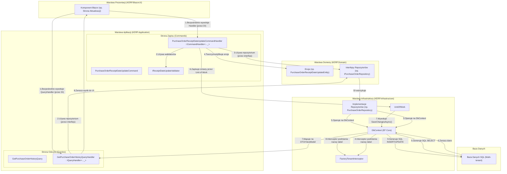
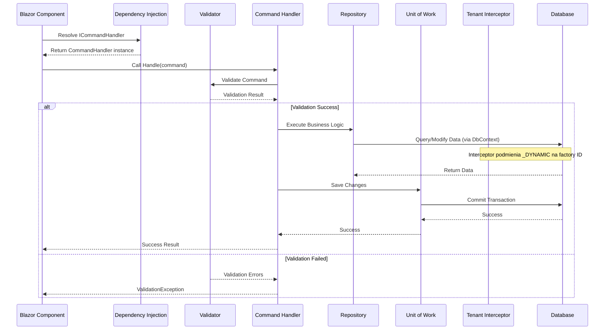

## Główny Graf Architektury - Poprawiony

```mermaid
graph TD
    subgraph "Warstwa Prezentacji (KERP.BlazorUI)"
        UI_Component["Komponent Blazor (np. Strona Aktualizacji)"]
    end

    subgraph "Warstwa Aplikacji (KERP.Application)"        
        subgraph "Strona Zapisu (Commands)"
            C_Command["PurchaseOrderReceiptDateUpdateCommand"]
            C_Handler["PurchaseOrderReceiptDateUpdateCommandHandler : ICommandHandler<..._>"]
            C_Validator["IReceiptDateUpdateValidator"]
        end
        
        subgraph "Strona Odczytu (Queries)"
            Q_Query["GetPurchaseOrderHistoryQuery"]
            Q_Handler["GetPurchaseOrderHistoryQueryHandler : IQueryHandler<..._>"]
        end
    end

    subgraph "Warstwa Domeny (KERP.Domain)"
        D_Entities["Encje (np. PurchaseOrderReceiptDateUpdateEntity)"]
        D_Interfaces["Interfejsy Repozytoriów (np. IPurchaseOrderRepository)"]
    end

    subgraph "Warstwa Infrastruktury (KERP.Infrastructure)"
        I_Repositories["Implementacje Repozytoriów (np. PurchaseOrderRepository)"]
        I_DbContext["DbContext (EF Core)"]
        I_UoW["UnitOfWork"]
        I_Interceptor["FactoryTenantInterceptor"]
    end

    subgraph "Baza Danych"
        Database["Baza Danych SQL (Multi-tenant)"]
    end

    %% Przepływ Komendy (Zapis) - BEZ MEDIATORA
    UI_Component -- "1.Bezpośrednio wywołuje Handler (przez DI)" --> C_Handler
    C_Handler -- "2.Używa walidatorów" --> C_Validator
    C_Handler -- "3.Używa repozytorium (przez interfejs)" --> D_Interfaces
    C_Handler -- "4.Tworzy/modyfikuje encje" --> D_Entities
    D_Interfaces -- "DI wstrzykuje" --> I_Repositories
    I_Repositories -- "5.Operuje na DbContext" --> I_DbContext
    C_Handler -- "6.Zapisuje zmiany przez Unit of Work" --> I_UoW
    I_UoW -- "7.Wywołuje SaveChangesAsync()" --> I_DbContext
    I_DbContext -- "8.Interceptor podmienia nazwy tabel" --> I_Interceptor
    I_DbContext -- "9.Generuje SQL INSERT/UPDATE" --> Database

    %% Przepływ Zapytania (Odczyt) - BEZ MEDIATORA
    UI_Component -- "1.Bezpośrednio wywołuje QueryHandler (przez DI)" --> Q_Handler
    Q_Handler -- "2.Używa repozytorium (przez interfejs)" --> D_Interfaces
    I_Repositories -- "3.Operuje na DbContext" --> I_DbContext
    I_DbContext -- "4.Interceptor podmienia nazwy tabel" --> I_Interceptor
    I_DbContext -- "5.Generuje SQL SELECT" --> Database
    Database -- "6.Zwraca dane" --> I_DbContext
    I_DbContext -- "7.Mapuje na DTO/ViewModel" --> Q_Handler
    Q_Handler -- "8.Zwraca wynik do UI" --> UI_Component
```

## Sekwencja bez Mediatora

```mermaid
sequenceDiagram
    participant UI as Blazor Component
    participant DI as Dependency Injection
    participant VLD as Validator
    participant CMD as Command Handler
    participant REPO as Repository
    participant UOW as Unit of Work
    participant INT as Tenant Interceptor
    participant DB as Database
    
    UI->>DI: Resolve ICommandHandler
    DI-->>UI: Return CommandHandler instance
    UI->>CMD: Call Handle(command)
    CMD->>VLD: Validate Command
    VLD-->>CMD: Validation Result
    
    alt Validation Success
        CMD->>REPO: Execute Business Logic
        REPO->>DB: Query/Modify Data (via DbContext)
        Note over INT,DB: Interceptor podmienia _DYNAMIC na factory ID
        DB-->>REPO: Return Data
        CMD->>UOW: Save Changes
        UOW->>DB: Commit Transaction
        DB-->>UOW: Success
        UOW-->>CMD: Success
        CMD-->>UI: Success Result
    else Validation Failed
        VLD-->>CMD: Validation Errors
        CMD-->>UI: ValidationException
    end
```